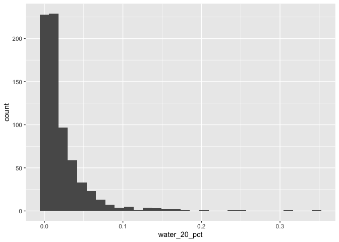

Geog6300: Lab 6
================

## Regression

``` r
library(sf)
library(tidyverse)
library(knitr)
library(car)
library(lmtest)
```

**Overview:** This lab focuses on regression techniques. You’ll be
analyzing the association of various physical and climatological
characteristics in Australia with observations of several animals
recorded on the citizen science app iNaturalist.

\###Data and research questions###

Let’s import the dataset.

``` r
lab6_data<-st_read("data/aus_climate_inat.gpkg")
```

    ## Reading layer `aus_climate_inat' from data source 
    ##   `/Users/jacobhamil/Desktop/GEOG4300/Lab 6/data/aus_climate_inat.gpkg' 
    ##   using driver `GPKG'
    ## Simple feature collection with 716 features and 22 fields
    ## Geometry type: POLYGON
    ## Dimension:     XY
    ## Bounding box:  xmin: 113.875 ymin: -43.38632 xmax: 153.375 ymax: -11.92074
    ## Geodetic CRS:  WGS 84 (CRS84)

The dataset for this lab is a 1 decimal degree hexagon grid that has
aggregate statistics for a number of variables:

- ndvi: NDVI/vegetation index values from Landsat data (via Google Earth
  Engine). These values range from -1 to 1, with higher values
  indicating more vegetation.
- maxtemp_00/20_med: Median maximum temperature (C) in 2000 or 2020
  (data from SILO/Queensland government)
- mintemp_00/20_med: Median minimum temperature (C) in 2020 or 2020
  (data from SILO/Queensland government)
- rain_00/20_sum: Total rainfall (mm) in 2000 or 2020 (data from
  SILO/Queensland government)
- pop_00/20: Total population in 2000 or 2020 (data from NASA’s Gridded
  Population of the World)
- water_00/20_pct: Percentage of land covered by water at some point
  during the year in 2000 or 2020
- elev_med: Median elevation (meters) (data from the Shuttle Radar
  Topography Mission/NASA)

There are also observation counts from iNaturalist for several
distinctively Australian animal species: the central bearded dragon, the
common emu, the red kangaroo, the agile wallaby, the laughing
kookaburra, the wombat, the koala, and the platypus.

Our primary research question is how the climatological/physical
variables in our dataset are predictive of the NDVI value. We will build
models for 2020 as well as the change from 2000 to 2020. The second is
referred to as a “first difference” model and can sometimes be more
useful for identifying causal mechanisms.

\###Part 1: Analysis of 2020 data###

We will start by looking at data for 2020.

**Question 1** *Create histograms for NDVI, max temp., min temp., rain,
and population, and water in 2020 as well as elevation. Based on these
graphs, assess the normality of these variables.*

``` r
#Code goes here.
ggplot() + 
  geom_histogram(data = lab6_data, aes(x = ndvi_20_med))
```

    ## `stat_bin()` using `bins = 30`. Pick better value with `binwidth`.

<!-- -->

``` r
ggplot() + 
  geom_histogram(data = lab6_data, aes(x=maxtemp_20_med))
```

    ## `stat_bin()` using `bins = 30`. Pick better value with `binwidth`.

<!-- -->

``` r
ggplot() + 
  geom_histogram(data = lab6_data, aes(x = mintemp_20_med))
```

    ## `stat_bin()` using `bins = 30`. Pick better value with `binwidth`.

<!-- -->

``` r
ggplot() + 
  geom_histogram(data = lab6_data, aes(x=rain_20_sum))
```

    ## `stat_bin()` using `bins = 30`. Pick better value with `binwidth`.

<!-- -->

``` r
ggplot() + 
  geom_histogram(data = lab6_data, aes(x=pop_20))
```

    ## `stat_bin()` using `bins = 30`. Pick better value with `binwidth`.

<!-- -->

``` r
ggplot() + 
  geom_histogram(data = lab6_data, aes(x=water_20_pct))
```

    ## `stat_bin()` using `bins = 30`. Pick better value with `binwidth`.

<!-- -->

First, looking at histogram from the ndvi/vegetation index, the
histogram appears to be skewed towards the right which would indicate
that the data is not normally distributed. Second, looking at the
histogram from the maximum temperature variable, it appears that the
histogram is skewed towards the left and therefore is not normally
distributed. After this, the minimum temperature histogram is still
slightly skewed to the left but less skewed than the maximum temperature
histogram. Then, the rain_sum histogram is clearly skewed towards the
right and not normally distributed. Lastly, the population histogram
appears to be skewed towards the right with a clear spike in counts on
the left side of the histogram and small little peaks after the large
spike. Therefore, this variable is also not normally distributed based
on its histogram!

**Question 2** *Use tmap to map these same variables using Jenks natural
breaks as the classification method. For an extra challenge, use
`tmap_arrange` to plot all maps in a single figure.*

``` r
library(tmap)
```

    ## Breaking News: tmap 3.x is retiring. Please test v4, e.g. with
    ## remotes::install_github('r-tmap/tmap')

``` r
ndvi <- tm_shape(lab6_data) + 
  tm_polygons("ndvi_20_med", style="jenks")
max_temp <- tm_shape(lab6_data) + 
  tm_polygons("maxtemp_20_med", style = "jenks")
min_temp <- tm_shape(lab6_data) + 
  tm_polygons("mintemp_20_med", style = "jenks")
rain_sum <- tm_shape(lab6_data) +
  tm_polygons("rain_20_sum", style = "jenks")
population_2020 <- tm_shape(lab6_data) + 
  tm_polygons("pop_20", style = "jenks")
water <- tm_shape(lab6_data) + 
  tm_polygons("water_20_pct", style = "jenks")

tmap_arrange(ndvi, max_temp, min_temp, rain_sum, population_2020, water)
```

    ## Legend labels were too wide. The labels have been resized to 0.55, 0.55, 0.55, 0.55, 0.55. Increase legend.width (argument of tm_layout) to make the legend wider and therefore the labels larger.

    ## Legend labels were too wide. The labels have been resized to 0.55, 0.55, 0.55, 0.55, 0.55. Increase legend.width (argument of tm_layout) to make the legend wider and therefore the labels larger.

    ## Some legend labels were too wide. These labels have been resized to 0.66, 0.66, 0.66, 0.66. Increase legend.width (argument of tm_layout) to make the legend wider and therefore the labels larger.

    ## Legend labels were too wide. The labels have been resized to 0.47, 0.44, 0.41, 0.41, 0.41. Increase legend.width (argument of tm_layout) to make the legend wider and therefore the labels larger.

    ## Some legend labels were too wide. These labels have been resized to 0.47, 0.44, 0.41, 0.41. Increase legend.width (argument of tm_layout) to make the legend wider and therefore the labels larger.

    ## Legend labels were too wide. The labels have been resized to 0.55, 0.55, 0.55, 0.55, 0.55. Increase legend.width (argument of tm_layout) to make the legend wider and therefore the labels larger.

<!-- -->

**Question 3** *Based on the maps from question 3, summarise major
patterns you see in the spatial distribution of these data from any of
your variables of interest. How do they appear to be associated with the
NDVI variable?*

First looking at the medium maximum temperature over Australia during
2020, the coolest temperatures are located along the Southeastern Coast
and Southern Australia at large, with higher median temperatures
existing in the northwestern and northern parts of the country. Next,
looking at the median minimum temperatures over Australia, the lowest
minimum median temperatures exist once again along the Southeastern
coast of Australia and Southern Australia at large, with the highest
minimum temperatures existing in the Northern and Northwestern parts of
the country. The total rainfall variable shows maximums in rain towards
the northern parts of the country, the southeastern and eastern portions
of the country, and a small little area of increased rainfall in the
Southwestern portion of the country. The spatial distribution of the
population appears to be centered around cities in the Southwestern
coast, the Southeastern Coast, and the Eastern Coast. I belieive that
these cities are Perth, Brisbane, Sydney, Melbourne, and Canberra.
Lastly, the total percent of water coverage shows higher values in
Southwest Australia and directly west of the Eastern coastline of the
country.

Now, taking all of these variables and comparing it to the ndvi
variable, which is a measurement of how much vegetation is an area with
values closer to one having more vegetation we see that generally cooler
maximum and minimum temperatures correspond to higher ndvi values. In
addition, higher total rainfall occurs with higher ndvi values (with
only an exception in far northern Australia which is more remote jungle
like terrain). The areas with the highest population tend to also occur
in areas with the highest ndvi indexes. Lastly, it appears that the
total amount of water covering land does not as strong an associated
with ndvi, however just off the maxmimum water contours we see some
increased ndvi contours which could indicate that more fertile land
comes from the increased water coverage.

**Question 4** *Create univariate models for each of the variables
listed in question 1, with NDVI in 2020 as the dependent variable. Print
a summary of each model. Write a summary of those results that indicates
the direction, magnitude, and significance for each model coefficient.*

``` r
model_max_temp <- lm(ndvi_20_med~maxtemp_20_med, data=lab6_data)
model_min_temp <- lm(ndvi_20_med~mintemp_20_med, data=lab6_data)
model_rain <- lm(ndvi_20_med~rain_20_sum, data=lab6_data)
model_population <- lm(ndvi_20_med~pop_20, data=lab6_data)
model_water <- lm(ndvi_20_med~water_20_pct, data=lab6_data)
summary(model_max_temp)
```

    ## 
    ## Call:
    ## lm(formula = ndvi_20_med ~ maxtemp_20_med, data = lab6_data)
    ## 
    ## Residuals:
    ##      Min       1Q   Median       3Q      Max 
    ## -0.41874 -0.07657 -0.01927  0.06833  0.36382 
    ## 
    ## Coefficients:
    ##                  Estimate Std. Error t value Pr(>|t|)    
    ## (Intercept)     0.6612389  0.0294372   22.46   <2e-16 ***
    ## maxtemp_20_med -0.0130902  0.0009601  -13.63   <2e-16 ***
    ## ---
    ## Signif. codes:  0 '***' 0.001 '**' 0.01 '*' 0.05 '.' 0.1 ' ' 1
    ## 
    ## Residual standard error: 0.1251 on 714 degrees of freedom
    ## Multiple R-squared:  0.2066, Adjusted R-squared:  0.2055 
    ## F-statistic: 185.9 on 1 and 714 DF,  p-value: < 2.2e-16

``` r
summary(model_min_temp)
```

    ## 
    ## Call:
    ## lm(formula = ndvi_20_med ~ mintemp_20_med, data = lab6_data)
    ## 
    ## Residuals:
    ##      Min       1Q   Median       3Q      Max 
    ## -0.36375 -0.08418 -0.03047  0.06972  0.40383 
    ## 
    ## Coefficients:
    ##                 Estimate Std. Error t value Pr(>|t|)    
    ## (Intercept)     0.464461   0.018997   24.45   <2e-16 ***
    ## mintemp_20_med -0.012282   0.001131  -10.86   <2e-16 ***
    ## ---
    ## Signif. codes:  0 '***' 0.001 '**' 0.01 '*' 0.05 '.' 0.1 ' ' 1
    ## 
    ## Residual standard error: 0.1301 on 714 degrees of freedom
    ## Multiple R-squared:  0.1418, Adjusted R-squared:  0.1406 
    ## F-statistic:   118 on 1 and 714 DF,  p-value: < 2.2e-16

``` r
summary(model_rain)
```

    ## 
    ## Call:
    ## lm(formula = ndvi_20_med ~ rain_20_sum, data = lab6_data)
    ## 
    ## Residuals:
    ##      Min       1Q   Median       3Q      Max 
    ## -0.56681 -0.04753 -0.01210  0.04599  0.30930 
    ## 
    ## Coefficients:
    ##              Estimate Std. Error t value Pr(>|t|)    
    ## (Intercept) 1.303e-01  7.060e-03   18.45   <2e-16 ***
    ## rain_20_sum 9.124e-07  3.953e-08   23.08   <2e-16 ***
    ## ---
    ## Signif. codes:  0 '***' 0.001 '**' 0.01 '*' 0.05 '.' 0.1 ' ' 1
    ## 
    ## Residual standard error: 0.1063 on 714 degrees of freedom
    ## Multiple R-squared:  0.4273, Adjusted R-squared:  0.4265 
    ## F-statistic: 532.6 on 1 and 714 DF,  p-value: < 2.2e-16

``` r
summary(model_population)
```

    ## 
    ## Call:
    ## lm(formula = ndvi_20_med ~ pop_20, data = lab6_data)
    ## 
    ## Residuals:
    ##      Min       1Q   Median       3Q      Max 
    ## -0.47003 -0.07883 -0.03949  0.06384  0.48974 
    ## 
    ## Coefficients:
    ##              Estimate Std. Error t value Pr(>|t|)    
    ## (Intercept) 2.552e-01  5.013e-03  50.902   <2e-16 ***
    ## pop_20      1.500e-06  1.500e-07   9.998   <2e-16 ***
    ## ---
    ## Signif. codes:  0 '***' 0.001 '**' 0.01 '*' 0.05 '.' 0.1 ' ' 1
    ## 
    ## Residual standard error: 0.1316 on 714 degrees of freedom
    ## Multiple R-squared:  0.1228, Adjusted R-squared:  0.1216 
    ## F-statistic: 99.97 on 1 and 714 DF,  p-value: < 2.2e-16

``` r
summary(model_water)
```

    ## 
    ## Call:
    ## lm(formula = ndvi_20_med ~ water_20_pct, data = lab6_data)
    ## 
    ## Residuals:
    ##      Min       1Q   Median       3Q      Max 
    ## -0.26898 -0.08838 -0.04838  0.06871  0.50911 
    ## 
    ## Coefficients:
    ##               Estimate Std. Error t value Pr(>|t|)    
    ## (Intercept)   0.268988   0.006287  42.781   <2e-16 ***
    ## water_20_pct -0.178263   0.154480  -1.154    0.249    
    ## ---
    ## Signif. codes:  0 '***' 0.001 '**' 0.01 '*' 0.05 '.' 0.1 ' ' 1
    ## 
    ## Residual standard error: 0.1403 on 714 degrees of freedom
    ## Multiple R-squared:  0.001862,   Adjusted R-squared:  0.0004636 
    ## F-statistic: 1.332 on 1 and 714 DF,  p-value: 0.2489

The first univariate model explains changes in NDVI with median maxmimum
temperatures across Australia. First looking at the intercept, with a
maximum median temperature of 0 degrees Celsius we would predict an NDVI
index of 0.661238. This value is very significant with a very low
p-value, and the direction of this intercept is positive because of the
positive NDVI value. Next, looking at the slope, with a one degree
celsius increase in maximum temperature we will see the NDVI drop by
0.0130902. This is also a very significant result with a very low
p-value, and the direction of this value is negative as the NDVI
decreases with every one unit increase in temperature.

The second univariate model explains changes in NDVI with median minimum
temperatures across Australia. Looking at the intercept, with a median
minimum temperature of zero degrees celsius we will see a NDVI index of
0.4644. This value is very significant because of its very low p-value,
and the direction of this value is positive because of its positive
magnitude. Next, looking at the slope we see with every one degree
celsius increase in median minimum temperatures we see a decrease of
0.012282 in the NDVI index. This is also a very signficant result with a
very low p-value, and the direction of thi value is negative because of
its negative magnitude

The third univariate model explains changes in NDVI with total rainfall
across Australia. Looking at the intercept, with zero total rainfall we
would expect a NDVI index of 0.1303. This value is significant with a
very low p-value and its direction is positive albeit barely positive.
Next, looking at the slope we see with every one mm increase in rainfall
we see an increase in the NDVI index of 9.124e-07. This is also a very
significant resuls with a very low p-value and a positive direction
because of its positive magnitude

The fourth univariate model explains changes in NDVI with total
population. Looking at the intercept, we see that with zero population
we would expect an NDVI index of 0.2552. This value is significant with
a very low p-value and a its direction is positive. Next, looking at the
slope, with a every one person increase in population we see an increase
in the NDVI index of 1.500e-06. This is also a significant result with a
very low p-value and a positve direction.

The last univariate model explains changes in NDVI with water coverage
over land. When there is no water coverage over land, we would expect an
NDVI index of 0.268988. This value is significant with a very low
p-value and a positive direction. Next, looking at the slope, with every
1% increase in water coverage we would expect the NDVI index to decrease
by 0.178263. This value is NOT significant with a p-value of 0.249, and
the direction of this is negative!

**Question 5** *Create a multivariate regression model with the
variables of interest, choosing EITHER max or min temperature (but not
both) You may also choose to leave out any variables that were
insignificant in Q4. Use the univa=riate models as your guide. Call the
results.*

``` r
#Code goes here
multi_model <- lm(ndvi_20_med ~ maxtemp_20_med + rain_20_sum + pop_20, data=lab6_data)
summary(multi_model)
```

    ## 
    ## Call:
    ## lm(formula = ndvi_20_med ~ maxtemp_20_med + rain_20_sum + pop_20, 
    ##     data = lab6_data)
    ## 
    ## Residuals:
    ##      Min       1Q   Median       3Q      Max 
    ## -0.54167 -0.02238  0.00814  0.03759  0.17686 
    ## 
    ## Coefficients:
    ##                  Estimate Std. Error t value Pr(>|t|)    
    ## (Intercept)     4.922e-01  2.202e-02  22.351  < 2e-16 ***
    ## maxtemp_20_med -1.179e-02  7.012e-04 -16.812  < 2e-16 ***
    ## rain_20_sum     8.648e-07  3.357e-08  25.766  < 2e-16 ***
    ## pop_20          3.024e-07  1.077e-07   2.808  0.00513 ** 
    ## ---
    ## Signif. codes:  0 '***' 0.001 '**' 0.01 '*' 0.05 '.' 0.1 ' ' 1
    ## 
    ## Residual standard error: 0.0872 on 712 degrees of freedom
    ## Multiple R-squared:  0.6158, Adjusted R-squared:  0.6142 
    ## F-statistic: 380.4 on 3 and 712 DF,  p-value: < 2.2e-16

**Question 6** *Summarize the results of the multivariate model. What
are the direction, magnitude, and significance of each coefficient? How
did it change from the univariate models you created in Q4 (if at all)?
What do the R2 and F-statistic values tell you about overall model fit?*

For this multivariate regression model, I decided to remove the water
coverage variable because the univariate model showed this variable was
not significant. So the variable I examined were maximum temperatures,
total rainfall, and population and their effect on the ndvi index.
Looking at the intercept, when max_temp, total rainfall, and population
are all zero, we would expect an NDVI index of 0.4922. With every one
degree celsius increase in maximum temperature we expect the NDVI index
to decrease by 0.01179. This is a signficant result because of the very
low p-value and has a negative direction because of its negative sign
With every one mm increase in total rainfall, we would expect the NDVI
index to increase by 8.648e-07 which is signficant (becaue of the very
low p-value) and has a positive direction (because of the positive sign
attached to the slope). Lastly, for every one person increase in
population we would expect the NDVI index to increase by 3.024e-07 which
is signficant but not as stronly signficant as the other coefficients
and has a positive direction. There was very minimal change in these
values in this multivariate model when compared to the results from the
individual univariate models. The R2 value tells us the percent of
variation in the dependent variable that can be explained by our
independent variables. In this case the R2 value is 0.6158 which
indicates that this data strongly fits the data and is a good model! The
F-statistic is very signficant which means that our model improves the
data compared to having a model with no independent variables.

**Question 7** *Use a histogram and a map to assess the normality of
residuals and any spatial autocorrelation. Summarise any notable
patterns that you see.*

``` r
#Code goes here
lab6_data$residuals<-residuals(multi_model)
ggplot(lab6_data, aes(x=residuals)) + 
  geom_histogram()
```

    ## `stat_bin()` using `bins = 30`. Pick better value with `binwidth`.

<!-- -->

``` r
tm_shape(lab6_data) + 
  tm_polygons("residuals", style = "jenks")
```

    ## Variable(s) "residuals" contains positive and negative values, so midpoint is set to 0. Set midpoint = NA to show the full spectrum of the color palette.

<!-- -->

First looking at the histogram of residuals, it appears that are
residuals are NOT normally distributed. But instead are skewed towards
the left which could be issues with the model. Then, looking at the map,
it also appears that the data is not normally distributed with points
with very negative residuals scattered around positive residuals. In
addition, the residuals are spatially autocorrelated and not random,
which indicates there could be issues with the model.

**Question 8** *Assess any issues with multicollinearity or
heteroskedastity in this model using the techniques shown in class. Run
the appropriate tests and explain what their results show you.*

``` r
#Code goes here
vif(multi_model)
```

    ## maxtemp_20_med    rain_20_sum         pop_20 
    ##       1.098341       1.071548       1.173265

``` r
bptest(multi_model)
```

    ## 
    ##  studentized Breusch-Pagan test
    ## 
    ## data:  multi_model
    ## BP = 65.65, df = 3, p-value = 3.642e-14

Running VIF to see if we have any issues with multicollinearity, we see
that each of the independent variables have values around 1. This means
that there is no correlation with the other variable, and means we don’t
have issues with multicollinearity.

Next, I ran bptest to see if there are any issues with
heteroscedasticity. The null hypothesis is there is no
heteroscedasticity and the alternative hypothesis means that there is
heteroscedastiticty in the model. Because we have such a small p-value,
we reject the null hypothesis and accept the alternative that there is
heteroscedasticity in the model.

**Question 9** *How would you summarise the results of this model in a
sentence or two? In addition, looking at the full model and your
diagnostics, do you feel this is a model that provides meaningful
results? Explain your answer.*

Overall I feel like the results from my univariate regression models and
my multivariate regression model gives meaningful results. However,
there appears to be some issues with the residuals that I think require
further examination to see if this model is as effective as I think it
could be.

\`\`\`

**Disclosure of assistance:** *Besides class materials, what other
sources of assistance did you use while completing this lab? These can
include input from classmates, relevant material identified through web
searches (e.g., Stack Overflow), or assistance from ChatGPT or other AI
tools. How did these sources support your own learning in completing
this lab?*

I used in-class notes and previous scripts from this class to help
complete this lab!

**Lab reflection:** *How do you feel about the work you did on this lab?
Was it easy, moderate, or hard? What were the biggest things you learned
by completing it?*

I felt like I did pretty well on this lab. I would say this lab was
overall easy, but the responses were moderate just because of how much a

**Challenge question**

\#Option 1 Create a first difference model. To do that, subtract the
values in 2000 from the values in 2020 for each variable for which that
is appropriate. Then create a new model similar to the one you created
in question 5, but using these new variables showing the *change in
values* over time. Call the results of the model, and interpret the
results in the same ways you did above. Also chart and map the residuals
to assess model error. Finally, write a short section that summarises
what, if anything, this model tells you.

\#Option 2 The animal data included in this dataset is an example of
count data, and usually we would use a Poisson or similar model for that
purpose. Let’s try it with regular OLS regression though. Create two
regression models to assess how the counts of two different animals
(say, koalas and emus) are associated with at least three of the
environmental/climatological variables given above. Be sure to use the
same independent variables in each model. Interpret the results of each
model and then explain the importance of any differences in the model
coefficients between them, focusing on direction, magnitude, and
significance.
